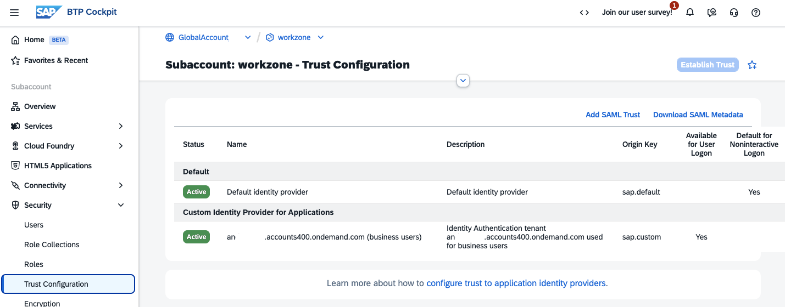
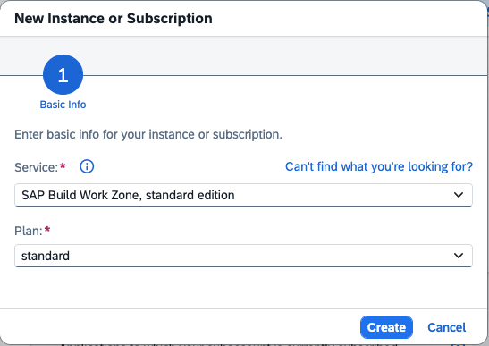
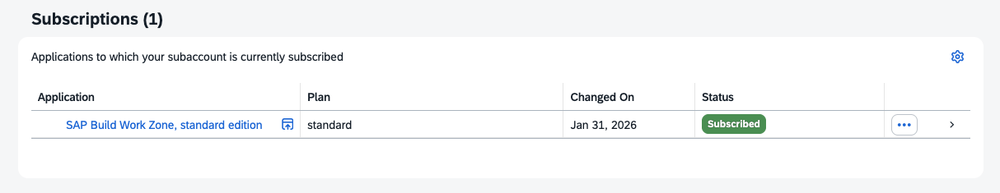
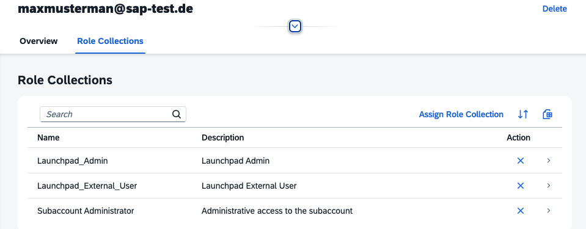
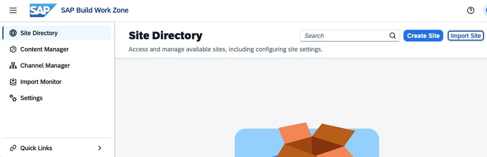

# Set Up SAP Build Work Zone

For this mission, SAP Build Work Zone is optional.
The Joule conversational search capability does not require integration with SAP Build Work Zone, standard edition. 

For other Joule capabilities, SAP Build Work Zone is required.

You can only connect to one Work Zone instance per Joule Instance. For more information, see [SAP Help Portal](https://help.sap.com/docs/joule/integrating-joule-with-sap/prerequisites?version=LATEST&locale=en-US)

In this mission, you use Build Work Zone, standard edition. For detailed information about setting up SAP Build Work Zone, see [SAP Help Portal](https://help.sap.com/docs/build-work-zone-standard-edition).
   
For supported Joule regions, see [Data Centers Supported by Joule](https://help.sap.com/docs/joule/serviceguide/data-centers-supported-by-joule).

### Set Up Build Work Zone

1. In your subaccount, navigate to Security --> Trust Configuration.
    Establish Trust in your Identity Authentication Tenant.

    

2. In your subaccount, navigate to Services --> Instances and Subscriptions.

3. Select "Create".

4. Choose "SAP Build Work Zone, standard edition" (or your edition).

5. As a service plan, select Subscription "standard" (or your plan).

    

6. Select Create. Work Zone will be subscribed.

    

7. Navigate to "Security" --> "Users". Select your business user, which authenticates against your Identity Authentication Tenant. Assign the role collection "Launchpad_Admin" if it is not already assigned.

    

8. Start the Build Work Zone Application in "Instances and Subscriptions". Click on the Application name.

9. You should see the Site Directory.

    

Congrats, you can continue with the Joule setup.

---
