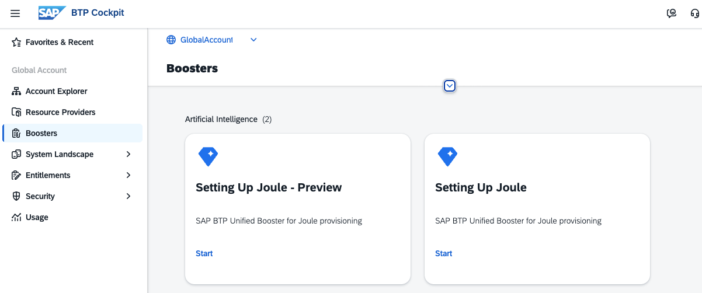
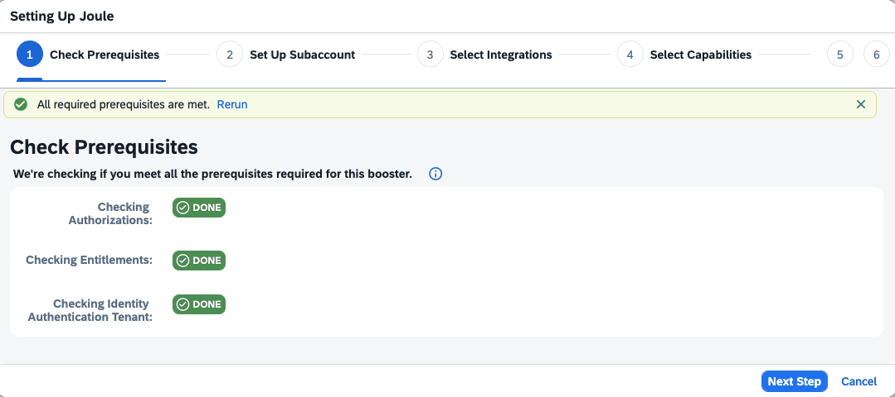
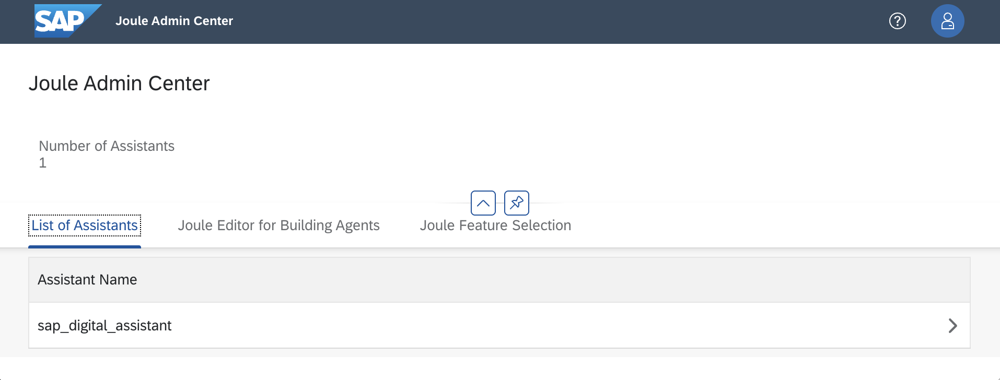
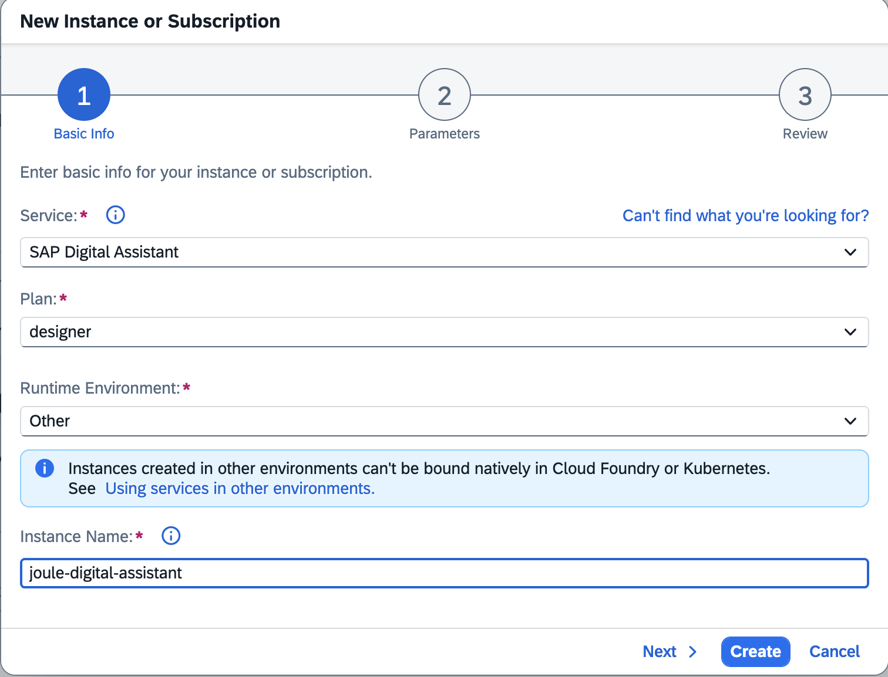
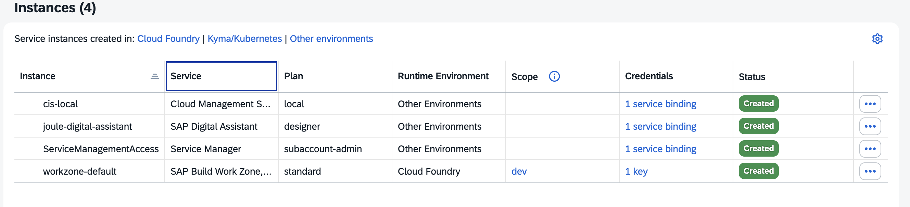

## Install Joule in your SAP BTP Enterprise Subaccount

In SAP Business Technology Platform (BTP), you provision and configure Joule yourself, with full control over subaccounts, entitlements, and system integrations. This is called "Customer Managed Provisioning".

### General Prerequisites

- You must have an SAP BTP Enterprise Account. 
- You have set up your global account.
- Your global account is entitled to use Joule with the service plans for Application (foundation or standard) and Instance (designer) for development.
- Your global account is entitled to an SAP product that supports Joule integration. In this mission, you use Build Work Zone. 
   
- For supported regions, see [Data Centers Supported by Joule](https://help.sap.com/docs/joule/serviceguide/data-centers-supported-by-joule)

### Specific Prerequisites

- You have created a subaccount in a supported region. The subaccount is for development.
- You have administrator access to this subaccount.
- You have enabled Cloud Foundry (which you need for the Joule instance).
- Your subaccount is entitled to use Joule (application and instance).
- Your subaccount is entitled to use Build Work Zone. Build Work Zone is set up.
- You have access to an SAP Identity Authentication Tenant.

> **Important:** If a Joule instance is already set up and running, you cannot run the setup again. If you need to add more systems, manually add them to the existing formation where Joule is already integrated. 

---

### Set Up Joule

1. In your subaccount, navigate to Security --> Trust Configuration.
    Establish Trust in your Identity Authentication Tenant.

2. Check and configure missing User Attributes for Joule from the Identity Directory. For more information, see [SAP Help](https://help.sap.com/docs/joule/integrating-joule-with-sap/configure-user-attributes-from-identity-directory)

3. Run the Joule Booster "Setting Up Joule" after having established trust and checked the user attributes (for more information about the Joule - Preview, see [SAP Help Portal](https://help.sap.com/docs/joule/integrating-joule-with-sap/joule-preview-landscape?version=LATEST&locale=en-US)).

   

4. Booster Step 1: Check that prerequisites must be passed:

   

5. Booster Step 2: Set up Subaccount. Choose your subaccount, containing Build Work Zone, select the right service plan for Joule (foundation or standard), and select a Cloud Foundry Space.

6. Booster Step 3: Select Integrations. Select product "SAP Build Work Zone".
    Select "This integration is used for", Production or Testing. If you are unsure, select "Testing".

7. Booster Step 4: Select Capabilities. Keep the capability entry for Build Work Zone.

    >Important: Decide if you want to store conversation data in this Joule Subscription. To change this afterward, you have to create a service ticket.

8. Booster Step 4: Set up Integrations. Select the dedicated Build Work Zone "System you want to include. Choose "Next".

9. Review and click "Finish", the subscription will start. 

10. When the subscription has finished successfully, check the service. Click on the application "Joule".

    A new browser tab opens und you should see this: `The service is up and running.`

---

### Create a Role Collection, Assign Roles and Users

As a tenant administrator in SAP BTP, assign the following roles to a Role Collection.

The role `extensibility_developer` can access the Joule standalone Web Client, compile, and deploy capabilities (with limitations). `end_user` can create conversations with Joule.

1. Add missing roles to your user. Navigate to "Security" --> Role Collections. Create a new Role Collection, name it, for example, "Joule Role Collection".

2. For Joule development, add at least the roles `extensibility_developer` and `end_user` to the Role Collection. Use the application identifier "das-application" to search for the available roles.

3. For authorization to the Joule Admin Center, add the role `tenant_admin`. For more information, see [SAP Help Portal](https://help.sap.com/docs/joule/serviceguide/joule-admin-center?version=LATEST&locale=en-US)

4. For authorization to the Joule Analytics Center, add the role `analytics_admin`. For more information, see [SAP Help Portal](https://help.sap.com/docs/joule/serviceguide/enabling-joule-analytics-center?version=LATEST&locale=en-US)

5. Assign the role collection to your user. Choose the user you will use for authentication during Joule development.

6. Log off and log in again.

### Open Joule Admin Center

1. In your Joule Subaccount, navigate to "Services" --> "Instances and Subscriptions" and click on your Joule Subscription. A new browser opens.

2. Add `/admin` to the URL.

3. The Admin Center opens.

    

4. Click on `sap_digital_assistant`. Not the deployed Scenarios. 

### Set Up SAP Digital Assistant

For development, you need to connect to Joule. 
For this, your subaccount needs the entitlement for the Service "Joule" (Service Technical Name "das-service") with the Plan "designer"

1. Check the entitlement for your subaccount, Service "Joule", Plan "designer".

2. Open "Cervices" --> "Instances and Subscriptions" and click "Create".

3. Select the Service `SAP Digital Assistant`.   
    Select the plan `designer`.   
    Select Runtime Environment `Other`
    Provide a name, e.g., `joule-digital-assistant`

    

4. Select "Create".

5. Once the service has been created, create a "service binding" and provide any name for the binding. 

    

6. Congrats, you can now access Joule using Joule CLI in the next chapter.

#### Additional Information

- [Joule Setup and Integration](https://help.sap.com/docs/joule/integrating-joule-with-sap/introduction?locale=en-US&version=LATEST)

- [SAP Build Work Zone and SAP Start](https://help.sap.com/docs/joule/integrating-joule-with-sap/integrating-content-with-sap-build-work-zone-foundation)

- [Configure Trusted Domains in Identity Authentication](https://help.sap.com/docs/joule/integrating-joule-with-sap/configure-trusted-domains-in-identity-authentication)

---

