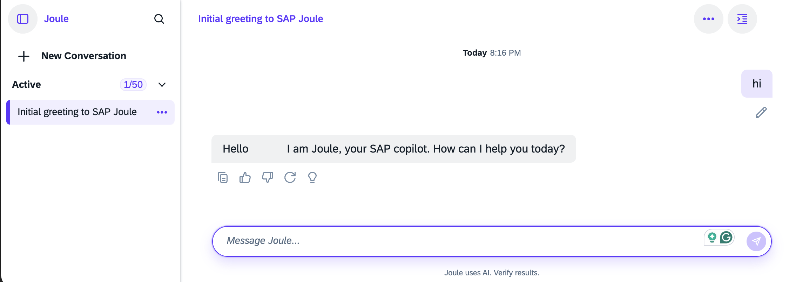

# Install Joule Studio CLI and Login to Joule on SAP BTP

Joule Studio CLI is a command-line interface tool that enables developers to work directly with Joule capabilities from the terminal. It integrates seamlessly into local development and CI/CD pipelines, and supports secure authentication, project compilation, and deployment to target runtimes.

The Joule CLI version (@sap/joule-studio-cli) for this mission is: 1.5.21

For a complete overview of Joule Studio CLI commands, see [SAP Help Portal](https://help.sap.com/docs/joule/joule-development-guide-ba88d1ec6a1b442098863d577c19b0c0/joule-studio-cli-commands).

If you want to use an AI Skill for Joule Studio CLI commands, visit SAP´s [AI Skills Library](https://skills.cloud.sap/skills/SAP-samples/joule-a2a-agent-toolkit/joule-cli) 


#### Features of Joule Studio CLI 1.5.21

- Manage Joule capabilities & digital assistants on SAP BTP
- Target Platform is SAP BTP / Joule service (XSUAA/IAS auth) 
- Build Unit is Capability (capability.sapdas.yaml)
- Focused on the Joule capability and Joule assistant (bundles capabilities) lifecycle

---

### Installation

#### Prerequisites for local installation

- Node.js (minimum 20.12.0, maximum 24) — download from https://nodejs.org/en/download/releases/ or via package manager, like homebrew
- A terminal 


#### Install Latest Version

`npm install -g @sap/joule-studio-cli`

#### Install Specific Version
`npm install -g @sap/joule-studio-cli@<version>`

##### Update

`npm install -g @sap/joule-studio-cli --force`

##### Uninstall

`npm uninstall -g @sap/joule-studio-cli`

> **Note:** Run `joule logout` **before** uninstalling if you want to delete all locally stored credentials — uninstalling the package alone does not clear them.

---

### Log in to Joule Studio CLI 


Joule Studio CLI, version 1.5.21.

```sh
joule [options] [command]
```

#### Global Options

| Option | Description |
|---|---|
| `-V, --version` | Show the version number |
| `-d, --debug` | Show and store extra debug logs |
| `-w, --no-color` | Display monochrome output |
| `-h, --help` | Display help for command |


---

#### Authentication

| Command | Description |
|---|---|
| `joule login [options]` | Log user in |
| `joule logout` | Log user out |
| `joule status` | Show the login status |


| Parameter | Value | Description |
|---|---|---|
| `--authurl, -a` | `<authurl>` | Authentication URL |
| `--apiurl` | `<apiurl>` | API URL |
| `--clientid, -c` | `<clientid>` | Instance Client ID |
| `--clientsecret, -s` | `<clientsecret>` | Instance Client Secret |
| `--username, -u` | `<username>` | Username |
| `--password, -p` | `<password>` | Password |
| `--default-idp, -i` | — | Use the `sap.default` IDP (default is `sap.custom`) |
| `--unsecure-storage, -e` | — | Store secrets in local public store (**not recommended**) |
| `--sso-passcode` | `[passcode]` | One-time passcode login (XSUAA only) |
| `--use-env` | `[path]` | Load credentials from a `.env` file |
| `--store-password` | — | Enable password storage (disabled by default) |

**Supported `.env` variables (for `--use-env`):**

The example values are placeholder values. Yours should look similar.

```
JOULE_API_URL=https://mysubaccount.authentication.eu12.hana.ondemand.com
JOULE_AUTH_URL=https://mysubaccount.eu10.sapdas.cloud.sap
JOULE_CLIENT_ID=sb-das-designer!b1234567|das-application!b123456
JOULE_CLIENT_SECRET=22941b27-6906-4a49-b584-09...
JOULE_USERNAME=danny.developer@company.com
JOULE_PASSWORD=yourpasswordgoeshere
JOULE_AUTH_SESSION={"accessToken": "<token>", "refreshToken": "<token>"}
JOULE_DEFAULT_IDP=<true|false>
```
JOULE_AUTH_SESSION is particularly useful in CI/CD pipelines or scripted workflows where interactive authentication is not possible. You do not need this in this mission.

**How you can use Joule login:**

```bash
# Interactive login
joule login

# Switch to SAP default IDP
joule login --default-idp

# For Docker containers or Linux scripts (credentials stored in plain text)
joule login --unsecure-storage

# One-time passcode (XSUAA)
joule login --sso-passcode

# Load credentials from .env in the current directory
joule login --use-env

# Fully inline (non-interactive)
joule login --apiurl <apiurl> -a <authurl> -c <clientid> -s <clientsecret> --username <u> --password <p>
```
This is how a full inline login with random values could look in the region eu10:

```bash
joule login --authurl 'https:/yoursubaccount.authentication.eu10.hana.ondemand.com' --clientid 'sb-das-designer!b1234567|das-application-canary!b123456' --clientsecret '22941b27-6906-4a49-b584-09b513082f35$N8bcCZhPHMfxyhV6V5JX2r/SpY7Vqeyp+ssvRguO9gA=' --username 'john.doe@company.com' --password 'yourpassword'
```

---
#### Launch Joule and Inspection

| Command | Description |
|---|---|
| `joule list [options]` | Display all deployed digital assistants in current tenant |
| `joule get [options] <digital assistant name>` | Display a specific deployed digital assistant in current tenant |
| `joule launch <digital assistant name>` | Launch a digital assistant using the Web Client |

"sap_digital_assistant" is preinstalled.

`joule launch sap_digital_assistant`

A new browser window opens. Start your chat with Joule.




---


### Login Troubleshooting

#### Common errors

| Error | Cause | Fix |
|---|---|---|
| Wrong Authentication URL | Incorrect format | XSUAA: `https://<tenant>.authentication.<landscape>.hana.ondemand.com` · IAS: `https://<IAS_tenant>.accounts*.ondemand.com` |
| Invalid API URL | URL not reachable | Open in browser — should display "Service up and running" |
| HTTP 401 | Invalid credentials | Check Client ID, Client Secret, Username, or Password |
| HTTP 403 | Missing roles | Ensure correct roles are assigned (see Assign Roles) |
| Wrong quote type | Syntax error | Use single quotes `'` to wrap inline parameter values |
| **`$` in secrets** | Shell expansion | Escape as `\$` |
| No password prompt (Linux) | Missing OS keyring libraries | Install `libsecret` and `gnome-keyring`; or use `--unsecure-storage` as a temporary workaround |
| `AUTH_FETCH_TOKEN_FAILED` (Node 20+) | IPv4/IPv6 autoselection issue | Set the env variable below |

---

#### Fix for `AUTH_FETCH_TOKEN_FAILED`:

```sh
# Linux / macOS
export NODE_OPTIONS="--no-network-family-autoselection"

# Windows
set NODE_OPTIONS=--no-network-family-autoselection
```

#### Create debug files

Add `-d` to any command to generate a timestamped JSON debug file. Attach this file when opening a support ticket.

```sh
joule login -d
joule compile -d
joule deploy -d
```

---
