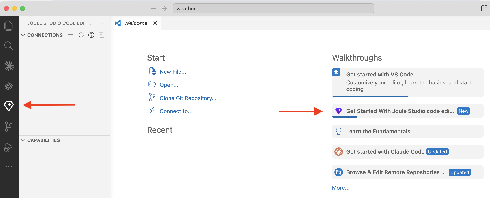
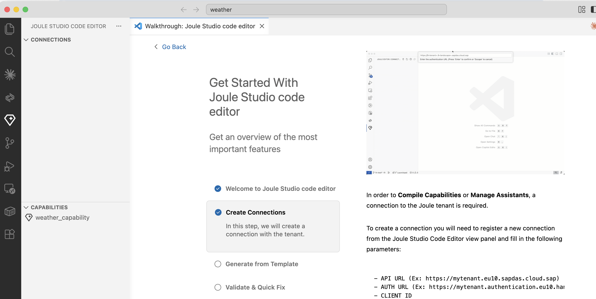
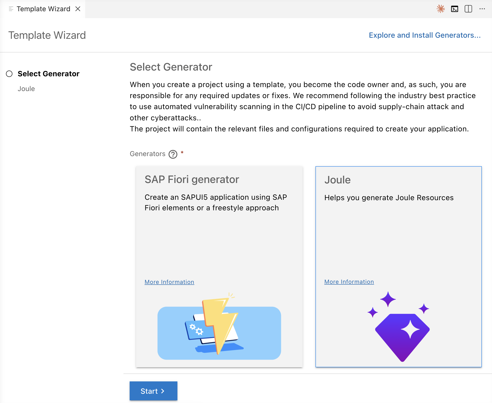
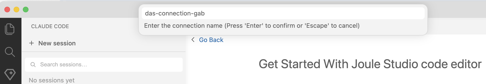
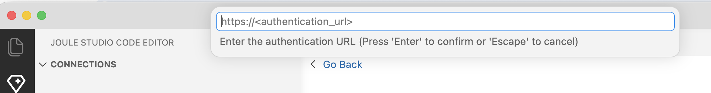
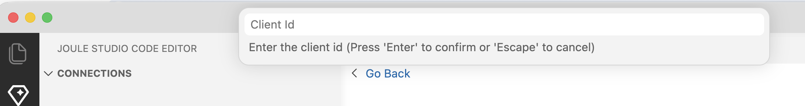
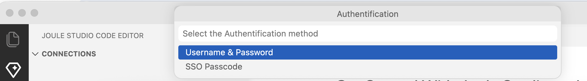
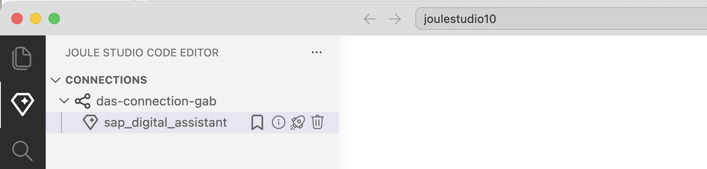

# Install Joule Studio code editor Extension

The "Joule Studio code editor" is a VS Code extension for building Joule Assistants. It activates automatically when the workspace contains an assistant and a YAML file is open in the editor.

For more information, see [VS Code Marketplace](https://marketplace.visualstudio.com/items?itemName=SAPSE.joule-studio-code-editor) and [SAP Help Portal](https://help.sap.com/docs/joule/joule-development-guide-ba88d1ec6a1b442098863d577c19b0c0/joule-studio-code-editor?version=LATEST&ai=true&locale=en-US).

### Features


- Validation: Validates YAML files against the DTA schema in real time
- Quick Fix: Suggests and applies fixes for validation errors
- Autocompletion: Context-aware suggestions while editing YAML 
- Template Wizard: Scaffolds a full assistant DTA or extends an existing one 
- Tenant connections: Register and manage connections to multiple Joule tenants in SAP BTP 
- Compile: Compile capabilities directly from VS Code 
- Deploy: Deploy assistants to your Joule tenant from VS Code
- Dependency graph: Visualize capability dependencies 
- Vibe coding: AI-assisted development of Joule agents 

### Installation

#### Prerequisites

- Node.js (minimum 20.12.0, maximum 24)
- VS Code **x64** version 1.99.0 or higher — download from https://code.visualstudio.com/download or via a package manager, e.g. `brew install --cask visual-studio-code` on macOS.

The recommended version of VS Code is the **x64** version. Check your version via *Code > About Visual Studio Code* (macOS) or *Help > About* (Windows).

--- 

#### Install the extension

Search for **Joule Studio Code Editor** in the [VS Code Marketplace](https://marketplace.visualstudio.com/items?itemName=SAPSE.joule-studio-code-editor) and click **Install**.

Check the installation. Click on the small Joule icon in your Activity Bar (left sidebar) to open Joule Explorer. Use it to manage connections to your Joule tenants and their deployed assistants.



Click on the Walkthrough for Joule Studio Code Editor.



--- 

#### Install the Joule Generator 

The Joule Studio code editor extension cannot install the Joule Generator.  

>**Note:** In order to use the Template Wizard to scaffold Joule projects, you need to install the Joule Generator.

1. Install Joule Generator using the terminal.

```bash
npm install @sap/generator-joule -g
```

2. Use Command Palette and open the Template Wizard.

   `>Open Template Wizard`

3. Here it is. You will use it when creating new projects.

    

---

#### Create a Connection

The next step is to create a connection to your SAP BTP Joule Subscription.

1. Click on the small `+` icon.

2. Provide a name of choice for your connection.
 
    

3. Provide the authentication URL from the service binding of your BTP instance SAP Digital Assistant. The identifier in the service binding is "url".

    

4. Confirm the API URL. It should be generated. It is the URL of the Joule Application service.


5. Enter client ID and client secret from service binding.
    
    
6. Select authentication method. Either the user and password or the SSO passcode.
    

7. The URL for SSO Passcode is simply authurl/passcode. For example, for region eu10, `https://yoursubaccount.authentication.eu10.hana.ondemand.com/passcode`. Copy and paste the generated passcode.

8. Once successfully connected, you will see the deployed assistants. Click on the small rocket to launch a Joule test web page for the assistant.

    

Congrats, you can now start to develop your own assistant.

--- 

#### Use Joule Explorer

Click the Joule icon in the Activity Bar.

| Action | How |
|---|---|
| Register connection | Click the *Register Connection* icon in the Joule Explorer header and follow the wizard |
| Edit connection | Right-click a connection → Edit connection |
| Unregister connection | Right-click a connection → Unregister connection |
| Sort assistants | Right-click a connection → Sort assistants (cycles: name A→Z → Z→A → default) |
| Delete assistant | Right-click an assistant → Delete assistant |
| Launch assistant | Right-click an assistant → Launch assistant (opens in default browser) |

> **Note:** Deleting an assistant permanently removes it from your Joule tenant in SAP BTP. Unregistering a connection removes it from the extension only — the Joule tenant and its assistants are not affected.
