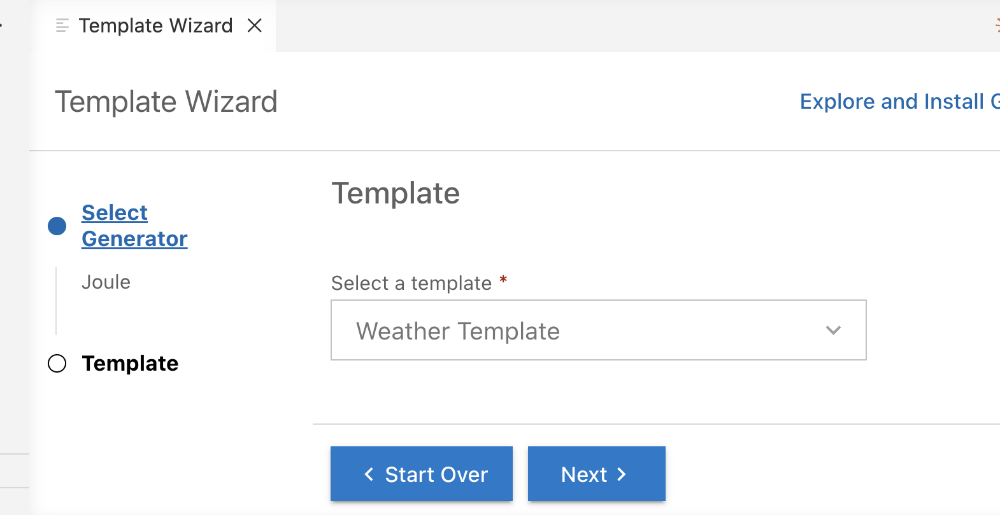
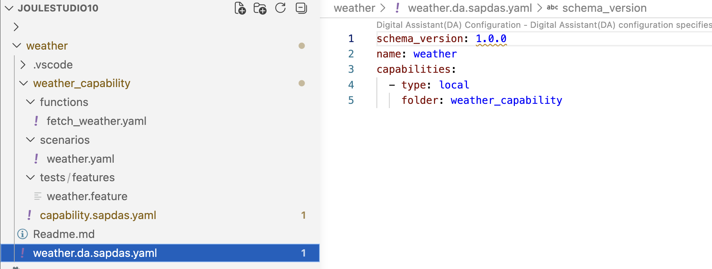
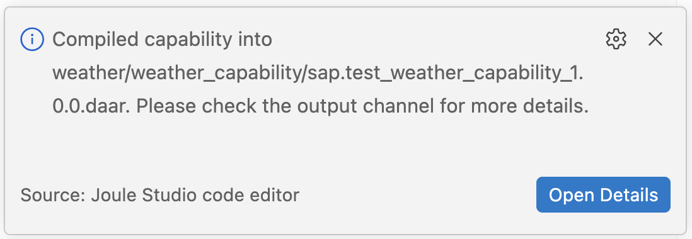
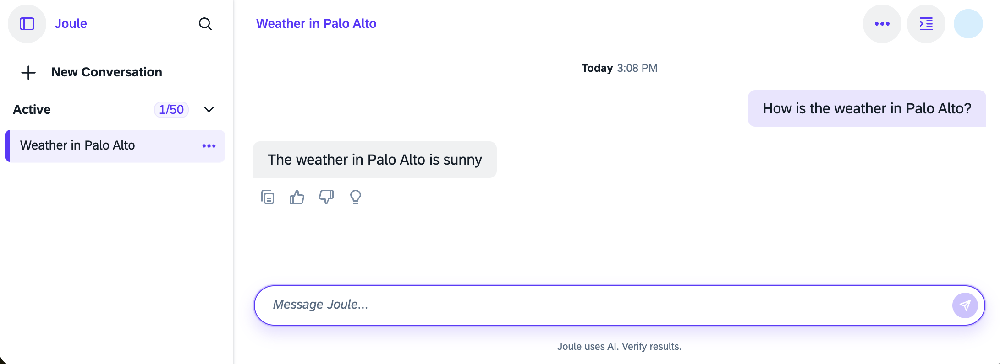

# Create, Compile, and Deploy a New Project

#### Create Weather Project

Your Joule Generator includes a small example. The "Weather" template.

1. Open the folder you want to work in using VS Code
2. Open the Command Palette (`Ctrl+Shift+P` / `Cmd+Shift+P`)
3. Search for **Open Template Wizard**
4. Select **Generators → Joule**
5. Choose the template *Weather* and follow the wizard

    

6. A basic Digital Assistant will be generated.
 
    


#### Explore the Digital Assistant

The following folder structure will be generated:

```
└── weather
    ├── weather_capability
    │   ├── functions
    │   │   └── fetch_weather.yaml
    │   ├── scenarios
    │   │   └── weather.yaml
    |   ├── tests/features
    │   │   └── weather.feature
    │   └── capability.sapdas.yaml
    ├── Readme.md
    └── weather.da.sapdas.yaml

```

The root folder contains the Joule assistant's `weather.da.sapdas.yaml`.

The subfolder weather_capability contains the `capability.sapdas.yaml`. Check it, it will always say the weather is sunny. You can change this later.

The  weather_capability already has a full skeleton:
 - A scenario (weather.yaml) that extracts the city slot from user input
 - A dialog function (fetch_weather.yaml) that accepts city and returns a response
 - A system alias WeatherService → BTP destination weather_destination

 However, fetch_weather.yaml currently uses a hardcoded set-variables stub instead of a real API call.
 

#### Make Mandatory Changes

1. Go to "weather/weather_capability/capability.sapdas.yaml". Change the `metadata: namespace: sap.test` to `namespace: joule.ext`.

2. Go to "weather/weather.da.sapdas.yaml" and change the `schema_version: 1.0.0` to `schema_version: 1.4.0`.

3. Go to "weather/weather_capability/capability.sapdas.yaml".  
    Change the schema_version to `schema_version: 3.26.0`.  
    For more information, see [SAP Help Portal](https://help.sap.com/docs/joule/joule-development-guide-4b327297dce247fcb88a5f5bfeea97a1/design-time-artifact-specification)


---

#### Compile the Capability

Click the Explorer icon in the Activity Bar to access the file tree. The following context menu actions are available:

1. Right-click `capability.sapdas.yaml`. In the context menu, choose "Compile this capability".

2. The result is a generated `weather/weather_capability/sap.test_weather_capability_1.0.0.daar`.

    

3. You can check the compiler output in the Output View. In this case, you receive a warning because an i18n file is missing.


#### Deploy the Assistant

Prerequisites: Your Joule connection must be up and connected.

If multiple connections are registered, you will be prompted via the Command Palette to select one.
If only one connection is registered, it is used automatically.

1. Right-click `weather/weather.da.sapdas.yaml`. Choose context "Deploy Assistant".

2. You should see the output "Deployment successful for weather.da.sapdas.yaml on das-connection."

3. Optional: Open the "Output" panel in VS Code and select "Joule: CLI" from the dropdown in the panel header. Check the output log.


#### Open assistant in browser 
 
1. Right-click `weather/weather.da.sapdas.yaml`. Choose context "Open in your Web Browser".

2. Test it with your preferred City.

3. As designed, the weather is always sunny.

    

---


----

