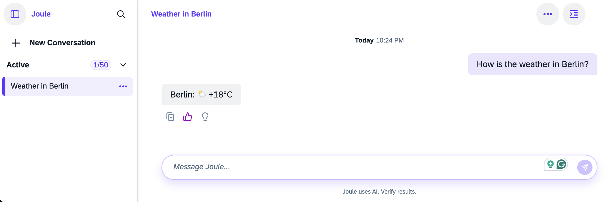

# Add an API Call to your Weather Capability

To get real-time weather data, you need to set up a weather API as a destination in BTP and make an API call.

Use your preferred weather API. This learning example uses [wttr.in](https://wttr.in), [GitHub Repo](https://github.com/chubin/wttr.in).

### Summary

- Create a BTP destination for your weather destination.

- Replace the hardcoded stub in `fetch_weather.yaml` with a real API call to the already defined weather destination.

- Update the BDD test to remove the hardcoded assertion that relied on the stub.


### Create BTP Destination in your Subaccount

In your Joule subaccount, navigate to Connectivity --> Destinations.

Create (or import) the following destination. Name must match your system alias definition:

```properties
Authentication=NoAuthentication
Name=weather_destination
ProxyType=Internet
Type=HTTP
URL=https\://wttr.in
```

---


### Make the following Code Changes (Diff View)

#### Diff: weather_capability/functions/fetch_weather.yaml

```diff
 parameters:
   - name: city
     optional: false
 
 action_groups:
   - actions:
-    # fake an api_request call by setting the weather_result variable
-    - type: set-variables
-      variables:
-        - name: weather_result
-          value:
-            status: 200
-            body: "The weather in <? city ?> is sunny"
-  - condition: weather_result.status != 200
+      - type: api-request
+        method: GET
+        system_alias: WeatherService
+        path: "/<? city.urlEncode() ?>?format=3&lang=en"
+        result_variable: weather_result
+
+  - condition: weather_result.status_code != 200
     actions:
       - type: message
         message:
           type: text
-          content: Sorry I could not fetch the weather for <? city ?>
-  - condition: weather_result.status == 200
+          content: Sorry, I could not fetch the weather for <? city ?>.
+
+  - condition: weather_result.status_code == 200
     actions:
       - type: message
         message:
           type: text
           content: <? weather_result.body ?>
```

#### Diff: weather_capability/tests/features/weather.feature

```diff
 Scenario: Weather with a city
     When I say "show me the weather in London"
     Then response has 1 message
     And first message content contains "London"
-    And first message content contains "sunny"
```

#### What has changed and why

##### Changes in fetch_weather.yaml

- `set-variables` stub → `api-request` | Makes a real HTTP GET to wttr.in 
- `system_alias: WeatherService` | Resolves to BTP destination `weather_destination` → `https://wttr.in` 
- `city.urlEncode()` in path | Safely encodes city names with spaces (e.g., "New York" → `New%20York`) 
- `?format=3&lang=en` | Depends on the api. format=3 returns a single line of plain text, e.g., `Berlin: ⛅️ +22°C` 
- `.status` → `.status_code` | `api-request` results use `status_code`; `.status` only existed on the fake stub object 

##### Changes in weather.feature

Removed `And first message content contains "sunny"` — this assertion was only valid against the hardcoded stub. 


### Weather Capability Code Changes (complete file)

#### 1. weather_capability/functions/fetch_weather.yaml


##### After Code Change
```yaml
parameters:
  - name: city
    optional: false

action_groups:
  - actions:
      - type: api-request
        method: GET
        system_alias: WeatherService
        path: "/<? city.urlEncode() ?>?format=3&lang=en"
        result_variable: weather_result

  - condition: weather_result.status_code != 200
    actions:
      - type: message
        message:
          type: text
          content: Sorry, I could not fetch the weather for <? city ?>.

  - condition: weather_result.status_code == 200
    actions:
      - type: message
        message:
          type: text
          content: <? weather_result.body ?>
```

---

#### 2. weather_capability/tests/features/weather.feature


##### After Code Change
```gherkin
Scenario: Weather with a city
    When I say "show me the weather in London"
    Then response has 1 message
    And first message content contains "London"
```

---


### Deployment Note

Always redeploy with `--compile` to ensure source changes are picked up:

```bash
joule deploy ./weather.da.sapdas.yaml --compile
```

Without `--compile`, the pre-existing `.daar` artifact in the capability folder is used, and code changes are ignored.

### Result

Launch your web browser from the updated assistant.




### Continue your Development Project.

If you want to continue your development project from here, visit SAP Help Portal, Joule Development Guide: [Build a Capability](https://help.sap.com/docs/joule/joule-development-guide-ba88d1ec6a1b442098863d577c19b0c0/build-capability?locale=en-US&version=LATEST).

You reached the end of the Get Started mission.

-------


